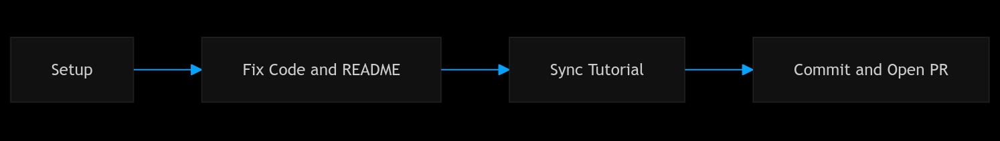

# Progi Documentation

- [Configuration](configuration.md)
- [Example Workflows](example-workflows.md)
- [FAQ](FAQ.md)
- [Glossary](glossary.md)
- [Use Cases](use-cases.md)
- [MCP config example](mcp.json.example)


## Example: you have a large prompt you want to "Progi-fy"
Prompt:
```md
hey progi, i have this process i've used in the past successfully, it's just one huge prompt, i want you to break this down for me so it works well with you, prompt: 
<INSERT YOUR LARGE PROMPT>
```

Then Progi creates a draft workflow, and might ask you clarifying questions, like:
```md
Before I save this, a few questions:

1. One task per language or one task for all languages? I've designed this as one task = one language, which means you'd create 5 tasks (rust, ruby, java, javascript, go) and run them in parallel. Does that match how you want to use it?

2. Docker container: Should "Setup" also handle spinning up the Docker container, or do you start the container manually before kicking off a task?

3. Credentials: The database address/username/password — do you want those baked into the playbook (as placeholders), or passed in as task input each time?

4. Repo URL: Is https://github.com/your-org/your-repo always the same, or should it be a task input?
```

Questions would be specific to your use case of course.

Then, Progi saves the workflow:
```md
Now let me save the skeleton first, then I'll get the playbook authoring prompts for each step.

Progi [save_workflow]

```

Finally, Progi confirms your complete workflow:
```
Done. The Agentic Fix-Up workflow is saved with 4 steps and full playbooks.

Here's what was created:
```

| Step | What the agent does |
|------|---------------------|
| 1. Setup | Asks for language, repo URL, database creds, and working folder. Clones the repo, creates the branch, starts the Docker container. |
| 2. Fix Code and README | Reads the language folder, identifies and fixes all issues, runs the example against the live cluster inside Docker, iterates until tests pass. |
| 3. Sync Tutorial | Opens docs/{language}.md, cross-references every snippet and command against the fixed code, updates anything out of sync. |
| 4. Commit and Open PR | Two commits (code+README, then tutorial), pushes the branch, opens PR titled "Fix and refactor {language} example". |

```md
To run this for all 5 languages in parallel: create 5 separate tasks (one per language) from this workflow and start them concurrently. Each task operates in its own {language}-testing/ folder with its own Docker container and branch, so they don't interfere with each other.

```

Progi Monitoring:

